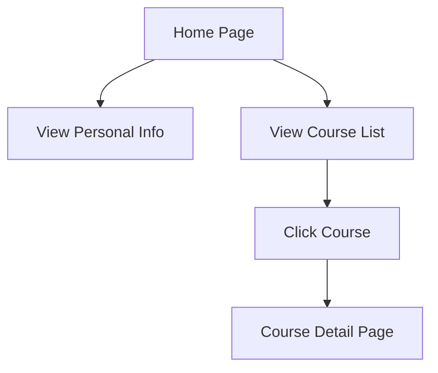

## 1. Product Overview
个人课程展示页面，用于展示傅欣梅的课程信息和个人资料
- 主要功能是展示个人信息和课程列表，方便后续补充课程内容
- 目标用户是学生、同事和教育机构，展示教学内容和专业能力

## 2. Core Features

### 2.1 User Roles
| Role | Registration Method | Core Permissions |
|------|---------------------|------------------|
| Visitor | No registration required | View all content |

### 2.2 Feature Module
1. **Home page**: personal information section, course list, navigation
2. **Course detail pages**: course content, materials, notes (to be added later)

### 2.3 Page Details
| Page Name | Module Name | Feature description |
|-----------|-------------|---------------------|
| Home page | Personal Info | Display name, school, major, and brief introduction |
| Home page | Course List | Show all courses with titles, brief descriptions, and links to detail pages |
| Home page | Navigation | Simple navigation for future expansion |
| Course detail pages | Course Content | Detailed information about each course (to be added later) |

## 3. Core Process
Users visit the home page to view personal information and course list, then click on specific courses to view detailed content.

## 4. User Interface Design
### 4.1 Design Style
- Primary color: #3b82f6 (blue)
- Secondary color: #10b981 (green)
- Button style: rounded corners, subtle shadows
- Font: Inter (sans-serif), 16px base size
- Layout style: card-based, clean, minimalistic
- Icon style: simple, linear icons

### 4.2 Page Design Overview
| Page Name | Module Name | UI Elements |
|-----------|-------------|-------------|
| Home page | Hero Section | Personal photo, name, school, major, brief bio, subtle animation |
| Home page | Course List | Card-based layout, hover effects, course titles, brief descriptions |
| Home page | Footer | Contact information, copyright |

### 4.3 Responsiveness
- Desktop-first design
- Mobile-adaptive layout
- Touch optimization for mobile devices

### 4.4 3D Scene Guidance
- Not applicable for this project