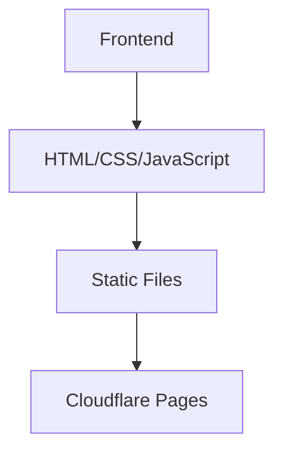

## 1. Architecture Design

## 2. Technology Description
- Frontend: Pure HTML5 + CSS3 + JavaScript
- Initialization Tool: None (static website)
- Backend: None (static website)
- Database: None (static website)

## 3. Route Definitions
| Route | Purpose |
|-------|---------|
| / | Home page with personal info and course list |
| /courses/python-basics | Python基础课程页面 (to be added later) |
| /courses/data-analysis | 数据分析技术课程页面 (to be added later) |
| /courses/data-collection | 数据采集与处理课程页面 (to be added later) |
| /courses/supply-chain | 供应链数据分析课程页面 (to be added later) |
| /courses/database | 数据库原理与应用课程页面 (to be added later) |

## 4. API Definitions
- Not applicable for static website

## 5. Server Architecture Diagram
- Not applicable for static website

## 6. Data Model
- Not applicable for static website